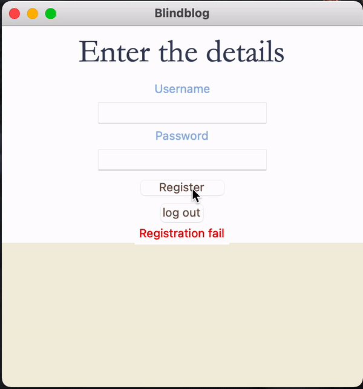
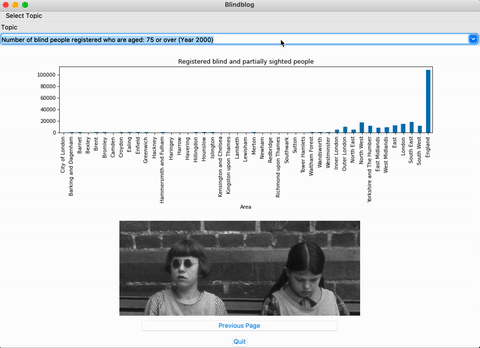
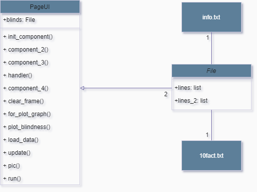

# Your Application Name
`Blindblog` is a blog committed to providing users with information about blindness, including causes, symptoms, and other information that users may not be familiar of.
> This program is not only for blind people, everyone can use this blog.
## Description
- The user must first register in order to connect to the blog; if the user clicks the register button without entering a username or password, **a warning letter will appear**; if registration is successful, the user may read any post and plot the graph.

- The program has Scroll text and buttons for going to the next or previous page, as well as the ability to create a bar graph on the last page.
- The plot page allows the user to select a topic for the plot graph. The topics are about ***blind and partially sighted persons from 2000 to 2008***, separated by **age groups**, and the number of registers of those people in each year and age group will be related in ***cities in England***.

## Running the Application
- This program uses two text files and csv file, such as `10fact.txt`, `info.txt` and `registered-blind-and-partially-sighted-people-by-age-group.csv`
- So can launch the program in the file `BlindblogUI.py` and that will start.
## Design
- Everything about my program was developed with the intention of using simple code and running quickly, with only two classes in my application. In terms of interface design, I'd like to create many pages to present information and produce graphs.
- This is UML class diagram of this project.

## Design Patterns Used
>I used the **Factory pattern** and **Prototype pattern**  in my program between class`File` and `PageUI`, and it works when I have file text, and it can also work with Scroll-text if I add more files.
## Other Information
>These links provided me with knowledge on blind people. [What You Need to Know About Blindness](https://www.healthline.com/health/blindness) and [10 little-known facts about blindness](https://www.perkins.org/10-little-known-facts-about-blindness/).